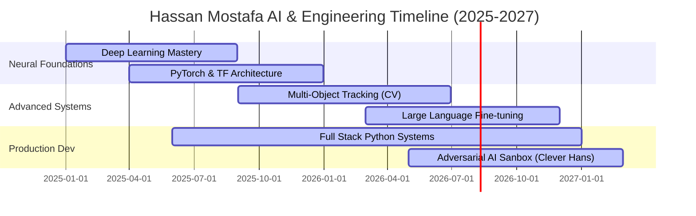

<!--
  SPDX-License-Identifier: MIT
  Author: Hassan Mostafa (AI Engineer)
  Theme: Cyberpunk Black & Red Neon
-->

<div align="center">

  <!-- Animated Cyberpunk Banner -->
  

  <br />

  <!-- Visitor Counter & Dynamic Status Badges -->
  <p align="center">
    
    
    
  </p>

  <!-- Typing Text Subtitle -->
  <p align="center">
    
  </p>

  <!-- Social Terminals -->
  <p align="center">
    <a href="mailto:ai3semester5@gmail.com">
      
    </a>
    <a href="https://linkedin.com/in/hassanmostafa" target="_blank">
      
    </a>
    <a href="https://github.com/hassanmostafa" target="_blank">
      
    </a>
  </p>

</div>

---

###  <code>[INITIALIZE_SYSTEM_OVERVIEW]</code>

```yaml
Hassan Mostafa:
  Role: AI Engineer
  Focus: Machine Learning, Deep Learning, Computer Vision, NLP
  Core_Directive: "Synthesizing computational frameworks with cognitive intelligence"
```

Hello! I am a passionate **AI Engineer** and AI student. Computer Science & AI Student focused on Machine Learning, Deep Learning, Computer Vision, and Natural Language Processing. Experienced as a Full Stack Python Developer building highly resilient architectures.

---

###  <code>[COGNITIVE_SKILL_MATRIX]</code>

<div align="center">
  
  <table>
    <tr>
      <td width="33%" valign="top">
        <h4 align="center">📟 CORE LANGUAGES</h4>
        <p align="center">
          <br/>
          <br/>
          <br/>
          <br/>
          <br/>
          
        </p>
      </td>
      <td width="33%" valign="top">
        <h4 align="center">🧠 AI & DEEP LEARNING</h4>
        <p align="center">
          <br/>
          <br/>
          <br/>
          <br/>
          
        </p>
      </td>
      <td width="33%" valign="top">
        <h4 align="center">🧱 WEB & INFRASTRUCTURE</h4>
        <p align="center">
          <br/>
          <br/>
          <br/>
          <br/>
          
        </p>
      </td>
    </tr>
  </table>

</div>

---

###  <code>[GITHUB_TROPHY_CASE]</code>

<div align="center">
  
</div>

---

###  <code>[FEATURED_COMPUTATIONAL_PROJECTS]</code>

<table width="100%">
  <!-- Project proj-1 -->
  <tr>
    <td width="60%">
      <h4>⚡ Resume Classification System</h4>
      <p>An intelligence parser and machine learning classifier designed to categorize hundreds of engineering resumes. Employs NLP pipeline models, token embeddings, and fine-tuned classifiers to map resume content directly to specific organizational tech tracks.</p>
      <p>
        
        
        
      </p>
    </td>
    <td width="40%" align="center">
      
    </td>
  </tr>
  
  <!-- Project proj-2 -->
  <tr>
    <td width="60%">
      <h4>⚡ Computer Vision Tracking System</h4>
      <p>Deep Learning multi-object tracking system capable of real-time spatial path prediction. Integrates custom YOLO frames with advanced tracking filter architectures (Kalman Filters, DeepSORT) to persist IDs through intensive visual occlusions.</p>
      <p>
        
        
        
      </p>
    </td>
    <td width="40%" align="center">
      
    </td>
  </tr>
  
  <!-- Project proj-3 -->
  <tr>
    <td width="60%">
      <h4>⚡ Sentiment Analysis Engine</h4>
      <p>Large scale text sentiment engine powering real-time analytics streaming. Implements Custom recurrent architectures (LSTMs) and Attention-driven networks to detect contextual semantics, sarcasm, and emotional scores across global feeds.</p>
      <p>
        
        
        
      </p>
    </td>
    <td width="40%" align="center">
      
    </td>
  </tr>
  
  <!-- Project proj-4 -->
  <tr>
    <td width="60%">
      <h4>⚡ Clever Hans Sandbox</h4>
      <p>An experimental harness implementing robust security testing for neural models. Tests networks against adversarial disturbances (FGSM, PGD attacks), assessing defense boundaries and analyzing structural vulnerability vectors.</p>
      <p>
        
        
        
      </p>
    </td>
    <td width="40%" align="center">
      
    </td>
  </tr>
  
  <!-- Project proj-5 -->
  <tr>
    <td width="60%">
      <h4>⚡ Portfolio Website</h4>
      <p>Highly tailored 3D interactive matrix demonstrating engineered products. Utilizes React, Three.js, and custom WebGL shaders styled inside a black-red cyberpunk aesthetic to represent active neural layers in real-time execution.</p>
      <p>
        
        
        
      </p>
    </td>
    <td width="40%" align="center">
      
    </td>
  </tr>
</table>

---

###  <code>[METRIC_DASHBOARD]</code>

<div align="center">
  
  <table>
    <tr>
      <td width="50%" align="center">
        <h4>📊 SYSTEM ACTIVITY & STATS</h4>
        
      </td>
      <td width="50%" align="center">
        <h4>⚡ COGNITIVE STREAK</h4>
        
      </td>
    </tr>
    <tr>
      <td width="50%" align="center">
        <h4>📟 TOP LANGUAGES ENGINE</h4>
        
      </td>
      <td width="50%" align="center">
        <h4>💻 REAL-TIME ACTIVITY GRID</h4>
        
      </td>
    </tr>
  </table>

</div>

---

###  <code>[NEURAL_CONTRIBUTION_SNAKE]</code>

<div align="center">
  <picture>
    <source media="(prefers-color-scheme: dark)" srcset="https://raw.githubusercontent.com/hassanmostafa/hassanmostafa/output/github-contribution-grid-snake-dark.svg" />
    <source media="(prefers-color-scheme: light)" srcset="https://raw.githubusercontent.com/hassanmostafa/hassanmostafa/output/github-contribution-grid-snake.svg" />
    
  </picture>
</div>

---

###  <code>[CODING_PHILOSOPHY]</code>

```python
class CognitiveEngine:
    def __init__(self):
        self.motivation = "Build AI systems that amplify human potential"
        self.code_style = "Elegant, decoupled, resilient, extremely structured"
        
    def execute(self, challenge):
        while not self.solved(challenge):
            model = self.train_deep_model()
            system = self.engineer_robust_backend()
            self.optimize_low_level_tensors()
        return "Pristine execution completed."
```

---

###  <code>[COGNITIVE_ROADMAP_&_TIMELINE]</code>



#### 📍 CURRENT_LEARNING_FOCUS_NODE
- 🚀 **Advanced Reinforcement Learning**: Studying PPO, SAC algorithms and custom multi-agent environments.
- 🚀 **Parameter-Efficient LLM Customization (LoRA)**: Integrating PEFT tools to align foundational models with specific domains.
- ⚙️ **Low-Level High-Performance CUDA Kernels**: Optimizing matrix operations in C++/CUDA to run natively on tensor cores.

---

<div align="center">
  <!-- Cyberpunk Footer SVG -->
  
</div>
